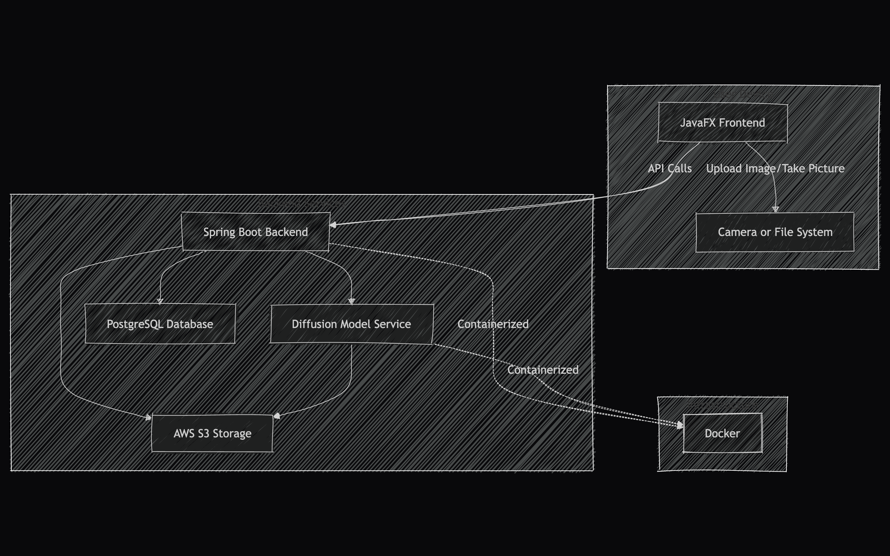
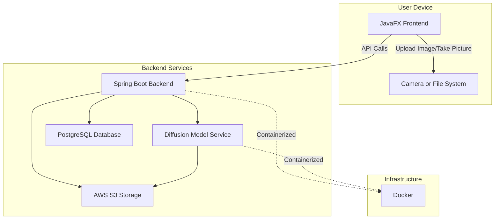

# Try On Application Proposal

## Project Overview

The **Try On** application allows users to virtually try on clothes without physically wearing them. Using advanced Diffusion models, the app provides a realistic visualization of users in selected outfits. The application consists of a JavaFX frontend and a Spring Boot backend, supported by PostgreSQL for user data storage and AWS S3 for image storage.

---

## Features

### Core Features

1. **User Registration and Login**
   - Secure registration and login system.
2. **User Profile**
   - Manage personal details.
3. **Take Picture Using Camera**
   - Capture an image directly within the app.
4. **Upload Image**
   - Upload an existing photo.
5. **Select Clothes**
   - Browse and choose outfits.
6. **Try On Clothes**
   - Virtual fitting feature using tweaked Diffusion models.
7. **Save Image**
   - Save the generated "try-on" images.
8. **Share Image**
   - Share images on social media.
9. **History of Clothes Tried On**
   - View previously tried outfits.

---

## Technologies Used

1. **Frontend**: JavaFX
2. **Backend**: Spring Boot
3. **Database**: PostgreSQL
4. **Storage**: AWS S3 (compatible storage)
5. **Machine Learning**: Custom Diffusion Model (run as a separate backend service)
6. **Containerization**: Docker

---

## User Flow

1. **Registration/Login**
   - User registers or logs in to access features.
2. **Image Upload**
   - Upload an image or take a picture using the camera.
3. **Select Clothes**
   - Choose outfits to try on.
4. **Virtual Try-On**
   - View themselves wearing the selected outfit.
5. **Save or Share Image**
   - Save or share the generated image.
6. **View History**
   - Check the history of tried outfits.

---

## System Architecture

The application consists of the following components:

1. **Frontend**: JavaFX-based desktop application for user interaction.
2. **Backend**: Spring Boot server for API management and user authentication.
3. **Diffusion Model Service**: Standalone service for image generation using machine learning models.
4. **Database**: PostgreSQL for storing user data, profile details, and history.
5. **Storage**: AWS S3-compatible storage for images (uploaded and generated).
6. **Containerization**: Docker for deployment and service orchestration.

---

## System Architecture Diagram

<!-- image -->

---

## Deployment Plan

1. **Dockerize Services**
   - JavaFX Application
   - Spring Boot Backend
   - Diffusion Model Service
2. **Use Docker Compose**
   - Simplify multi-container setup.
3. **Deploy on Cloud Infrastructure**
   - AWS or any suitable cloud platform.
4. **Secure Connections**
   - HTTPS for secure communication between components.

---

## Roadmap

1. **Phase 1**
   - Implement core Try-On functionality using the Diffusion model.
2. **Phase 2**
   - Add user management (registration/login, profile).
3. **Phase 3**
   - Enable sharing, saving images, and history tracking.
4. **Phase 4**
   - Optimize UI and performance.
